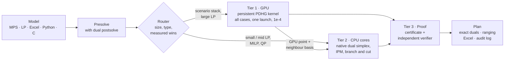
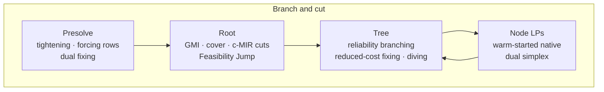
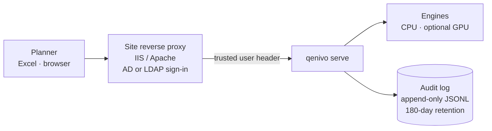

<div align="center">

# QENIVO

**Quantified · Exact · Native · Independent · Verified · Optimisation**

A certified optimisation engine for LP, MILP and convex QP, written from the published mathematics,
with GPU-batched what-if planning for refineries and other process industries.

[](https://github.com/dhruva137/Q.E.N.I.V.O/actions/workflows/ci.yml)
[](LICENSE)
[](pyproject.toml)
[](#install)

</div>

---

QENIVO solves the models planners actually run: not one LP, but a **stack of what-if cases** (crude prices,
unit capacities, demand) over the same refinery matrix. The GPU solves the whole stack in one kernel
launch; the CPU turns every GPU point into an exact optimal vertex with exact shadow prices; and an
independent verifier re-checks a certificate for every answer before it is reported.

```text
$ qenivo solve plan.mps --cert plan.cert.json
plan: OPTIMAL  objective 211365.1348
  engine simplex on numpy  iterations 46  time 0.045s
  rel_primal 6.20e-17  rel_dual 3.51e-16  rel_gap 0.00e+00

$ qenivo verify plan.mps plan.cert.json --exact
  [PASS] primal feasible within tolerance     6.275e-17
  [PASS] dual feasible within tolerance       3.523e-16
  [PASS] duality gap within tolerance         4.572e-18
RESULT    VERIFIED
```

## Highlights

| | Result | Source |
|---|---|---|
| What-if stack on one A100 | 512 refinery LPs, all certified, **13.7 s** vs 767 s for HiGHS cold on 12 cores (**56×**) | [`a100_evidence_run1`](bench/results/a100_evidence_run1/HEADLINE.md) |
| What-if stack on 2× Tesla T4 | 256 cases **22.3 s** vs 975 s for HiGHS on the same machine (**43×**) | [`kaggle_t4_run1/T4.md`](bench/results/kaggle_t4_run1/T4.md) |
| Laptop GPU (RTX 5050) | 64 cases **28×** vs HiGHS cold on all 16 laptop cores | [`persistent_batch_rtx5050.jsonl`](bench/results/persistent_batch_rtx5050.jsonl) |
| Netlib LP | **97 / 98** verified optimal, matching HiGHS within 1e-6 | [`netlib_release_20260930.json`](bench/results/netlib_release_20260930.json) |
| Native C++ simplex | median **1.7×** HiGHS time on 14 hard Netlib LPs | [`native_simplex_speed_round2.jsonl`](bench/results/native_simplex_speed_round2.jsonl) |
| Solver libraries in the solve path | **none** (checked at run time by a provenance guard) | [`provenance.py`](src/qenivo/provenance.py) |

Every number comes from a results file in [`bench/results/`](bench/results) that records the commit, machine
and library versions. Failures stay in the files. The full table, requirement by requirement, and the places
where QENIVO is still slower than established solvers are in [docs/EVIDENCE.md](docs/EVIDENCE.md).

## How it works



1. **Tier 1, GPU.** A persistent cooperative CUDA kernel runs restarted Halpern PDHG for every case of the
   stack at once, with grid-wide synchronisation instead of host round trips (493 → 43 µs per iteration on
   qap15). It stops at 1e-3…1e-4, where first-order methods are fast.
2. **Tier 2, CPU.** Each case goes to the native C++ dual simplex, warm-started from a basis guessed from the
   GPU point and from the optimal basis of a neighbouring case, and returns an exact vertex.
3. **Tier 3, proof.** Each answer carries a certificate (residuals, a Farkas ray, or an unbounded ray). A
   separate verifier with its own MPS reader re-checks it; `--exact` re-checks in rational arithmetic.



## Engines

| Engine | Problem | Method |
|---|---|---|
| `simplex` | LP | Native C++ dual simplex: sparse LU with threshold/Markowitz pivoting and eta updates, dual steepest edge, bound-flipping ratio test, dual phase 1, cost perturbation; Python fallback |
| `ipm` / `ipm-native` | LP, QP | Mehrotra predictor-corrector; native supernodal sparse Cholesky with AMD / nested-dissection ordering |
| `pdhg` / `pdhg-rf` | LP | Restarted Halpern PDHG with reflection on CPU or GPU; float32 iterations with float64 refinement |
| `pdqp` | convex QP | Primal-dual first-order method for QP |
| `milp` | MILP | Branch and cut (above) |
| `milp-gpu` | MILP | GPU-batched branch and bound (plugin) |
| `miqp` | MIQP | Branch and bound over QP relaxations (plugin) |
| `race` | LP | Simplex, IPM and PDHG on separate cores; the first verified answer wins |

Also in the package, used from Python: `qenivo.engines.exact_lp` (rational arithmetic with iterative
refinement for proof-grade LP answers) and `qenivo.nlp` (expression graph with its own automatic
differentiation, filter line-search IPM and McCormick spatial branch and bound for pooling; preview).
`qenivo engines` lists what is installed. New engines register through `qenivo.register_engine` or the
`qenivo.engines` entry-point group.

## Install

```bash
pip install qenivo                  # CPU (NumPy + SciPy only)
pip install "qenivo[gpu]"           # with CUDA 12 (CuPy)
pip install "qenivo[server]"        # REST server and planner console
```

The native C++ cores are compiled on the target at first use with the machine's C++ compiler (g++, clang++
or MSVC-compatible MinGW) and cached per user; without a compiler QENIVO falls back to its Python engines.
From source:

```bash
git clone https://github.com/dhruva137/Q.E.N.I.V.O.git qenivo
cd qenivo
pip install -e ".[dev]"
pytest
```

Air-gapped sites: `python packaging/build_offline_bundle.py` produces every wheel with SHA-256 sums and an
SPDX SBOM. Container: `docker build -f packaging/Dockerfile .`

## Use

**Command line**

```bash
qenivo solve plan.mps --cert plan.cert.json     # route, solve, certify
qenivo verify plan.mps plan.cert.json --exact   # independent re-check
qenivo cases plan.mps cases.xlsx --out results.xlsx   # what-if stack from Excel
qenivo explain infeasible.mps                   # smallest relaxation that restores feasibility
qenivo range plan.mps                           # cost and right-hand-side ranging
qenivo model unit_commitment -p units=40 -o uc.mps
qenivo demo                                     # offline tour on built-in refinery models
```

**Python**

```python
import qenivo

sol = qenivo.solve("plan.mps")          # routed engine, certificate attached
print(sol.summary())
print(sol.table("y", top=10))          # shadow prices of the tightest limits
sol.save_certificate("plan.cert.json")
```

**Interfaces**

| Interface | Where |
|---|---|
| Command line | `qenivo --help` |
| Python API | `qenivo.solve`, `qenivo.read`, `qenivo.Problem` |
| REST server + planner console | `qenivo serve` ([docs/DEPLOYMENT.md](docs/DEPLOYMENT.md)) |
| Desktop app (offline window, per-launch token) | `qenivo desktop`; installer scripts in [`packaging/windows/`](packaging/windows) |
| Scriptable optimizer shell, QNV C subset | `qenivo io`, [`capi/compat/`](capi/compat) ([docs/COMPATIBILITY.md](docs/COMPATIBILITY.md)) |
| Shadow mode (diff an external solver against QENIVO) | `qenivo shadow` |
| C ABI | [`capi/qenivo.h`](capi/qenivo.h) |
| C#, Java, Julia (MathOptInterface), R, Rust | [`bindings/`](bindings) |
| Pyomo, PuLP, CVXPY adapters | [`bindings/`](bindings) |
| Excel / CSV case tables | `qenivo cases` |

## Built for plant IT



* Offline by design: no telemetry and no outbound connection anywhere in the code.
* Company sign-in through the existing reverse proxy; bearer tokens for shared servers.
* Append-only audit of every solve (user, model hash, engine, verdict, objective), kept 180 days by default.
* Windows and Linux; CPU is always enough, the GPU is used only where it measurably wins.

See [docs/DEPLOYMENT.md](docs/DEPLOYMENT.md) and [docs/GROUND_REALITY.md](docs/GROUND_REALITY.md).

## Sovereignty

* **From the mathematics.** Every method is an independent implementation of a published algorithm
  ([docs/REFERENCES.md](docs/REFERENCES.md), [NOTICE](NOTICE)). No code from any solver project is included.
* **Checked at run time.** Tripwires on every sparse direct solver and optimiser entry point; `qenivo info`
  and the test suite report zero calls. HiGHS appears only in `bench/` as a comparator.
* **Own GPU kernels.** The sparse products and the persistent PDHG kernel are CUDA source in this repository,
  compiled on the target with NVRTC; results are bit-for-bit repeatable.

## Documentation

| | |
|---|---|
| [Architecture](docs/ARCHITECTURE.md) | engines, certificates, router, extension points |
| [Evidence](docs/EVIDENCE.md) | every measured result and how to reproduce it |
| [Deployment](docs/DEPLOYMENT.md) | offline install, sign-in, audit, Windows service |
| [Compatibility](docs/COMPATIBILITY.md) | the `qenivo io` shell, the QNV C interface, shadow mode, sources and legal note |
| [Survey](docs/SURVEY.md) | how LP/MILP engines evolved and where this design sits |
| [Roadmap](docs/ROADMAP.md) | what comes next |
| [References](docs/REFERENCES.md) | the papers each component implements |
| [Notebooks](notebooks/README.md) | GPU campaigns on Colab A100 and Kaggle T4 |

## Citing

If QENIVO helps your work, please cite it with [CITATION.cff](CITATION.cff), and cite the methods it
implements; the key ones are:

```bibtex
@inproceedings{applegate2021pdlp,
  title     = {Practical Large-Scale Linear Programming using Primal-Dual Hybrid Gradient},
  author    = {Applegate, David and D{\'i}az, Mateo and Hinder, Oliver and Lu, Haihao and
               Lubin, Miles and O'Donoghue, Brendan and Schudy, Warren},
  booktitle = {Advances in Neural Information Processing Systems},
  year      = {2021},
  note      = {arXiv:2106.04756}
}
@article{lu2025cupdlpx,
  title   = {cuPDLPx: A Further Enhanced GPU-Based First-Order Solver for Linear Programming},
  author  = {Lu, Haihao and Peng, Zedong and Yang, Jinwen},
  journal = {arXiv preprint arXiv:2507.14051},
  year    = {2025}
}
@article{mehrotra1992,
  title   = {On the Implementation of a Primal-Dual Interior Point Method},
  author  = {Mehrotra, Sanjay},
  journal = {SIAM Journal on Optimization},
  volume  = {2}, number = {4}, pages = {575--601}, year = {1992},
  doi     = {10.1137/0802028}
}
```

## Licence

Apache-2.0. See [LICENSE](LICENSE) and [NOTICE](NOTICE).
