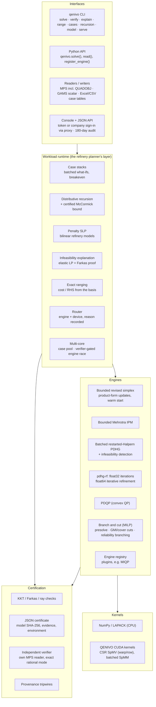

# QENIVO architecture

QENIVO is built the way a GPU computing platform is built: a small kernel layer that everything
else stands on, engines above it, a certification layer that every answer passes through, and a
workload layer that speaks the planner's language. Each layer can be replaced without touching
the others.

## L0 kernels (`src/qenivo/kernels`)

The first-order engines spend nearly all their time in `K @ X` and `K' @ Y`, where `X` has a
batch axis (one column per what-if scenario). On the GPU those products run on QENIVO's own
CUDA kernels (`cuda_kernels.py`), compiled at first use through NVRTC:

* `csr_spmv_warp`: one warp per row, lanes stride the row, shuffle reduction.
* `csr_spmm_rowmajor`: one block per row, threads stride the scenario axis, so neighbouring
  threads read neighbouring memory; S scenarios share one read of the matrix.

Both use a fixed reduction order and no atomics, so a GPU run is **bit-for-bit repeatable** on
the same card, which is a property an auditor can check. The vendor sparse library is kept behind
`kernels="vendor"` only as an A/B baseline.

## L1 engines (`src/qenivo/engines`)

| Engine | Method | Where it wins |
|---|---|---|
| `simplex` | bounded-variable revised primal/dual simplex; basis inverse in product form (LU of B0 plus one eta per pivot, refactorised every 64); Harris two-pass ratio tests; cost perturbation against dual stalling; bound flips; Bland fallback; warm start from a previous basis | small and medium LPs; exact vertex, basis, clean duals; ranging; node LPs of branch and cut |
| `ipm` | bounded-variable Mehrotra predictor-corrector; bounds as complementarity pairs, rows as bounded slacks, normal equations factored once per iteration and reused; equilibration | medium LPs to high accuracy in few iterations |
| `pdhg` | restarted Halpern PDHG with reflection, diagonal preconditioning, PID primal weight; batch axis; Farkas / ray detection | very large LPs, GPU, batches of scenarios |
| `pdhg-rf` | PDHG iterations in float32, answer refined in float64 (slack-form iterative refinement, correction LPs magnified by the inverse residuals) until the float64 KKT check passes | tight tolerances (1e-8 and below) on GPUs whose float64 is slow (T4, L4, RTX) |
| `pdqp` | PDQP (momentum, restarts, primal weight) | convex QP |
| `milp` | branch and cut: presolve with postsolve, root rounds of Gomory mixed-integer and knapsack cover cuts, reliability branching (strong branching on unreliable pseudocosts), best-bound / dive hybrid, rounding and diving heuristics, node LPs warm-started by dual simplex; incumbents checked on the original model | small and medium MILP |
| `miqp` (plugin) | branch and bound over PDQP relaxations, registered through `engines/registry.py` | mixed-integer convex QP; the worked example of extending the core |

## L2 certification (`src/qenivo/certify`)

No verdict is taken from an engine's word:

* **optimal:** primal and dual residuals and the duality gap on the original, unscaled model
  must meet the tolerance;
* **infeasible:** a Farkas ray `y` with `phi(y) > 0` that respects the sign rules;
* **unbounded:** a ray `d` with `c'd < 0` that stays inside the bounds.

Anything else is `not_proven`. Each answer becomes a JSON certificate (model SHA-256, verdict,
evidence, engine, routing reason, environment). `qenivo verify` re-checks it with a separate MPS
reader, name-keyed dictionaries and compensated summation, or with exact rational arithmetic
(`--exact`). The verifier shares no code with the engines.

The provenance guard installs tripwires on every sparse direct solver and optimiser entry point
of SciPy and refuses separately installed solver packages; the test suite runs every engine and
asserts zero calls.

## L3 workload runtime (`src/qenivo/workload`)

* **Router:** picks engine and device from size, batch and structure, and writes the reason into
  the certificate.
* **Case stacks:** one matrix, many data changes. On the GPU the whole stack is one batched
  solve; on the CPU each case is warm-started. Every case is certified. `crude_breakeven`
  sweeps a cargo's offer price.
* **Distributive recursion:** pools with any number of inputs and specification rows; five LP
  engine strategies including the step-bounded vertex control; `pooling_bound` builds and
  certifies the McCormick relaxation, so every recursion answer can carry a proven gap to the
  global optimum.
* **Penalty SLP:** for general bilinear refinery models read from GAMS: an l1-penalty
  trust-region successive LP whose steps are accepted on the true nonlinear merit.
* **Infeasibility explanation:** the elastic LP gives the smallest relaxation, row by row in the
  model's own names; its duals are the Farkas proof.
* **Ranging:** exact cost and right-hand-side ranges from the optimal basis.

## Built to grow

The problem statement asks for "a transparent, extensible and sovereign foundation". Growth is
designed in, not bolted on:

* **Extension point.** `register_engine(name, fn, classes)` or the `qenivo.engines` entry-point
  group adds an engine to the API, CLI and server with the same certificate path. MIQP ships as
  such a plugin; NLP / MINLP engines follow the same route.
* **Stable contracts.** Models are one data type (`Problem`); answers carry a versioned
  certificate (`qenivo.certificate/1`) that the verifier checks without the engines. An engine can
  be replaced or rewritten in C++/CUDA without changing any caller.
* **Measured, not claimed.** Every engine change is scored by the same harnesses (`bench/run.py`
  for Netlib, Kennington, Mittelmann, Maros-Meszaros; `bench/miplib_run.py` for MIPLIB;
  `bench/multicore.py`; the GPU campaigns), whose result files record the commit and machine.
* **Deployable where planners are.** Offline bundle with SBOM, Windows launcher, IIS sign-in
  template, audit trail, Excel case tables (`docs/DEPLOYMENT.md`, `docs/GROUND_REALITY.md`).
* **Every sector of the statement has a model** in `models/industry.py` (dispatch, unit
  commitment, transportation, facility location, lot sizing, crude blending, crude scheduling,
  multi-commodity flow), so a change to any engine is exercised on each of them by the tests.

## Design rules

1. Every number a user sees can be re-derived from a certificate.
2. Every benchmark result file carries the commit, the machine and the library versions; failures
   stay in the file.
3. Methods come from published mathematics and are credited in NOTICE; no solver library is in the
   solve path.
